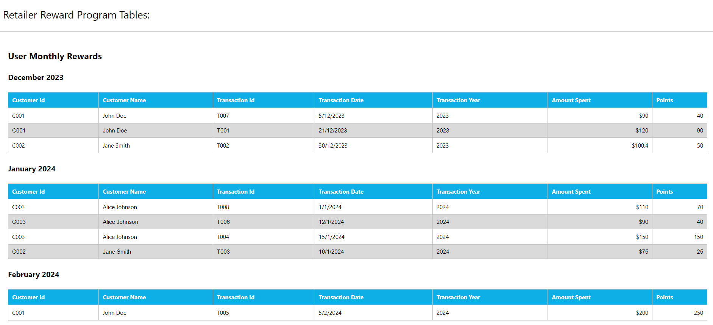
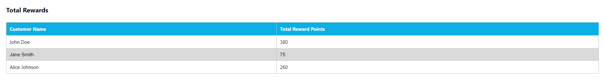
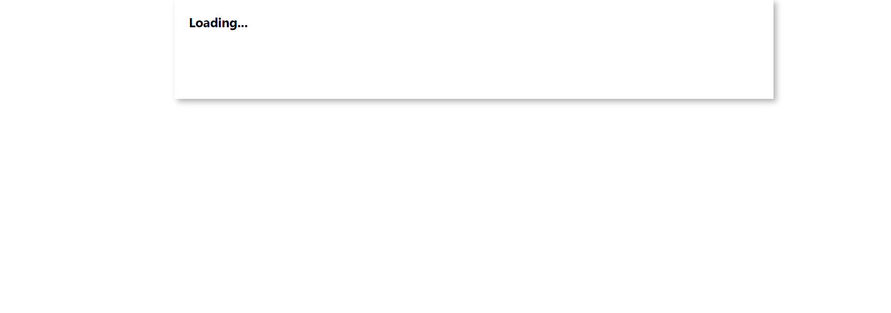
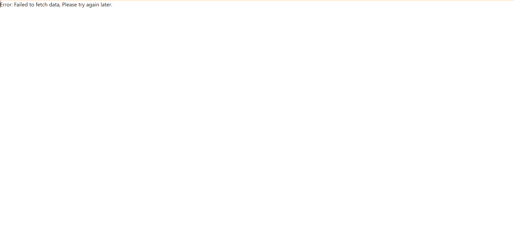
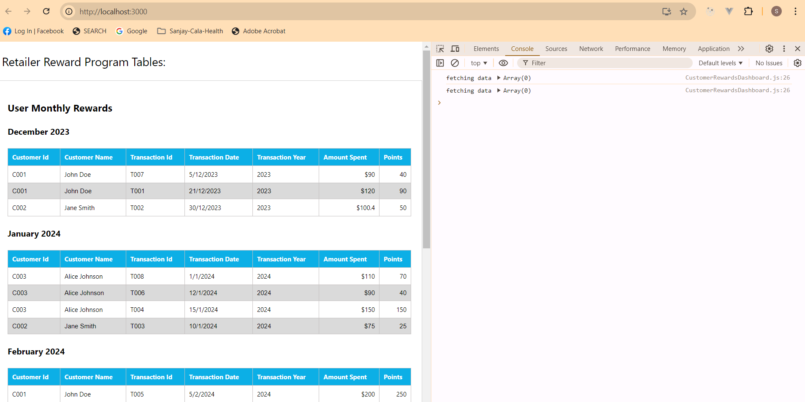

# Customer Rewards Assignment Program(Frontend)

A retailer offers reward points to its customers based on each recorded purchase.

## Project Description

A customer receives 2 points for every dollar spent over $100 in each transaction, plus 1 point for every dollar spent between $50 and $100 in each transaction.(ex. for $130 purchase, a customer receives 110 points($130 = 30*2 + 50 => 110 points)) and receives 1 point for every dollar spent over $50 and below $100(ex. for $70 purchase, a cusomer receives 20 points($70 = (70-50) * 1 => 20 points))
Given a record of every transaction during a three month period, calculating the reward points received for each customer per month and total.

## Tech Stack

** front-end:** React JS, ES6
** testing:** Jest & React Testing Library(RTL)

### Prerequisites

Node.js and npm installed

### Setup

1. **clone the repository:**
   https://github.com/sushmita30jan/reward-calculator/tree/main

2. **Install dependencies:**
   npm install

3. **Start the application:**
   npm start

4. **Test cases run:**
   npm test

### Usage

The application will run at port 3000 `http://localhost:3000`.

### Mock Data

The application uses mock data to simulate the reward calculation, the mock data is defined in `public/data.json`.

## Features

- Calculate reward points earned for each customer per month and total
- Show data based on latest consecutive N month period of time
- Transaction data can be with in the same year or spans different years
- Multiple transactions are displayed month-wise for the last 3 months.
- All transactions are displayed for the last 3 months.
- Loading indicator & Error handling implemented
- Different transaction logs displayed

### Screen shots of the Application

User Monthly Table-

Total Rewards Table-

All transactions Table-

Loading Indicator-

Error handling-

UI with logger-


### File Structure

reward-points/
└── 📁public
└── data.json
└── favicon.ico
└── index.html
└── logo192.png
└── logo512.png
└── manifest.json
└── robots.txt
└── 📁src
└── 📁**tests**
└── allTransactions.js
└── calculateRewardsByAmount.js
└── totalRewards.js
└── 📁components
└── 📁module
└── AllTransactions.js
└── CustomerRewardsDashboard.js
└── TotalRewards.js
└── UserMonthlyRewards.js
└── ErrorMessage.js
└── LoadingIndicator.js
└── ReusableTable.js
└── 📁services
└── fetchData.js
└── 📁utils
└── calculateRewards.js
└── calculateTotalAmountSpent.js
└── getMonthName.js
└── App.css
└── App.js
└── index.css
└── index.js
└── logger.js
└── setupTests.js

```

```
